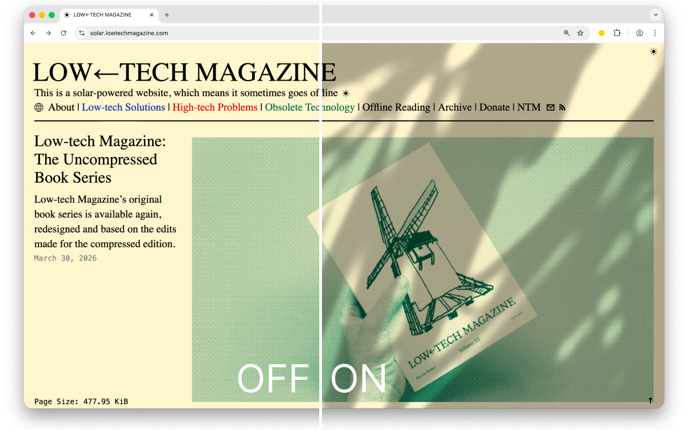

<p align="center">
  
</p>

# Sunshine

A browser extension that overlays beautiful shadow effects on any website. Built with [WXT](https://wxt.dev/), React, and Tailwind CSS.

<p align="center">
  
</p>


## Features

- **Global defaults** — pick a shadow and opacity once and they apply to every site you visit
- **Per-site overrides** — customize or disable the overlay on a single site without touching your global defaults; `www.example.com` and `example.com` share one override, but real subdomains (like `app.example.com`) are independent so apps on subdomains aren't affected
- **Shadow presets** — choose from four shadow styles: Whisper, Gentle, Dappled, and Deep
- **Opacity control** — adjust overlay intensity from 5% to 80%
- **Zero flicker** — content script injects at `document_start` so the overlay appears before the first paint

## Getting started

```bash
pnpm install
pnpm dev          # Chrome
pnpm dev:firefox  # Firefox
```

## Building

```bash
pnpm build          # Chrome
pnpm build:firefox  # Firefox
pnpm zip            # Package for Chrome Web Store
pnpm zip:firefox    # Package for Firefox Add-ons
```

## Tech stack

- [WXT](https://wxt.dev/) — next-gen browser extension framework
- [React 19](https://react.dev/) — popup UI
- [Tailwind CSS v4](https://tailwindcss.com/) — styling
- TypeScript
